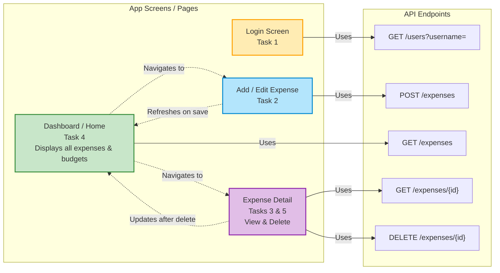

```mermaid
graph LR
    subgraph Screens["App Screens / Pages"]
        Login["Login Screen<br>Task 1"]
        Dashboard["Dashboard / Home<br>Task 4<br>Displays all expenses & budgets"]
        AddEdit["Add / Edit Expense<br>Task 2"]
        Detail["Expense Detail<br>Tasks 3 & 5<br>View & Delete"]
    end

    subgraph API_Endpoints["API Endpoints"]
        GetUser["GET /users?username="]
        PostExp["POST /expenses"]
        GetExps["GET /expenses"]
        GetExpByID["GET /expenses/{id}"]
        DelExp["DELETE /expenses/{id}"]
    end

    Login -->|Uses| GetUser
    AddEdit -->|Uses| PostExp
    Dashboard -->|Uses| GetExps
    Detail -->|Uses| GetExpByID
    Detail -->|Uses| DelExp

    Dashboard -.->|Navigates to| AddEdit
    Dashboard -.->|Navigates to| Detail
    Detail -.->|Updates after delete| Dashboard
    AddEdit -.->|Refreshes on save| Dashboard

    style Login fill:#ffecb3,stroke:#ffa000,stroke-width:2px
    style Dashboard fill:#c8e6c9,stroke:#388e3c,stroke-width:2px
    style AddEdit fill:#b3e5fc,stroke:#0288d1,stroke-width:2px
    style Detail fill:#e1bee7,stroke:#8e24aa,stroke-width:2px
```
